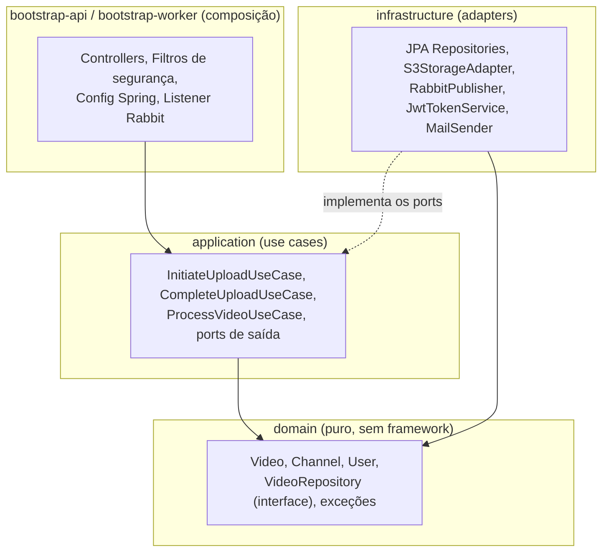

# Arquitetura em camadas (Clean Architecture)

A regra de dependência aponta sempre para dentro e é verificada por teste
(`ArchitectureTest`, ArchUnit): o domínio não conhece framework algum; os use cases falam com
interfaces (ports); os adapters implementam essas interfaces; os bootstraps compõem tudo.

| Módulo | Papel | Exemplos |
|---|---|---|
| `domain` | Entidades e regras puras | `Video`, `VideoRepository` (interface), `VideoExceptions` |
| `application` | Use cases orquestrando ports | `InitiateUploadUseCase`, `StoragePort`, `VideoProcessingPublisher` |
| `infrastructure` | Adapters com tecnologia real | `S3StorageAdapter`, `VideoRepositoryAdapter`, `RabbitVideoProcessingPublisher` |
| `bootstrap-api` | Aplicação REST | `VideosController`, `JwtAuthenticationFilter`, `SecurityConfig` |
| `bootstrap-worker` | Consumidor da fila + FFmpeg | `VideoProcessingListener`, `FfmpegVideoAnalyzer` |