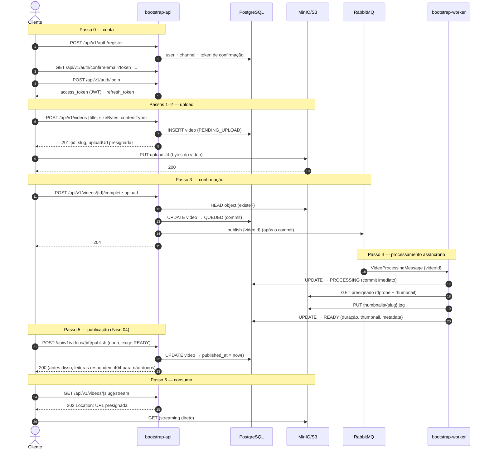

# Sequência — fluxo completo de upload

Do cadastro ao streaming. Os bytes do vídeo nunca passam pela API: o cliente envia e recebe
direto do MinIO/S3 via URLs presignadas; o processamento é assíncrono via RabbitMQ.

