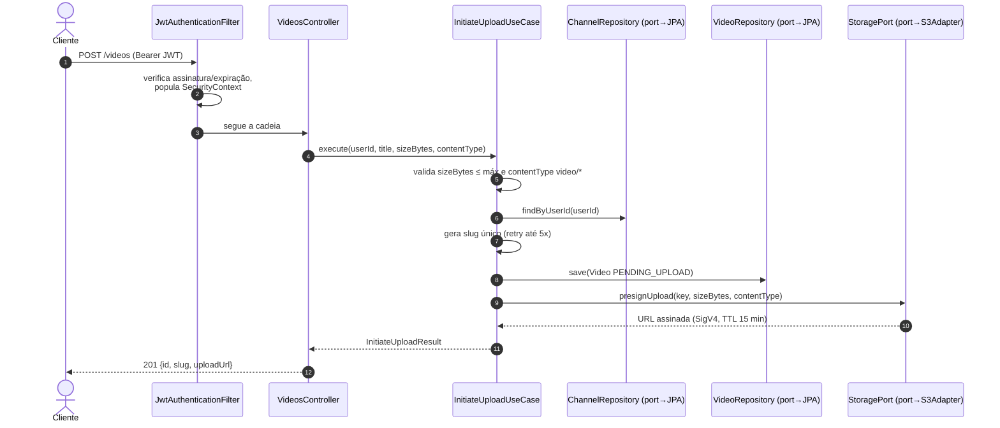

# Sequência — iniciar upload (`POST /videos`), camada por camada

O trajeto de uma única requisição autenticada pelas camadas da Clean Architecture: filtros de
segurança (bootstrap) → controller → use case (application) → ports → adapters (infrastructure).

O tamanho e o content-type declarados entram **na assinatura SigV4** da URL: o próprio storage
rejeita (403) um PUT cujos bytes ou tipo real divirjam do declarado.