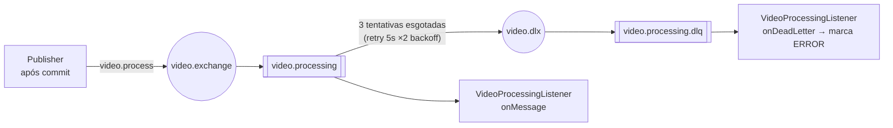

# Topologia RabbitMQ — processamento de vídeo

A mensagem `{"videoId": "..."}` é publicada **após o commit** da transação do complete-upload
(`AfterCommitExecutor`), para o worker nunca consumir um job cujo estado ainda não está no banco.
Falhas passam por 3 tentativas com backoff antes de caírem na dead-letter queue, onde o listener
marca o vídeo como `ERROR`.

| Nome | Valor (`VideoQueue`) |
|---|---|
| Exchange | `video.exchange` (direct) |
| Routing key | `video.process` |
| Fila principal | `video.processing` (durável, com DLX configurado) |
| Dead-letter exchange | `video.dlx` |
| Dead-letter queue | `video.processing.dlq` |
| Retry | 3 tentativas, intervalo inicial 5s, multiplicador 2.0, sem requeue |