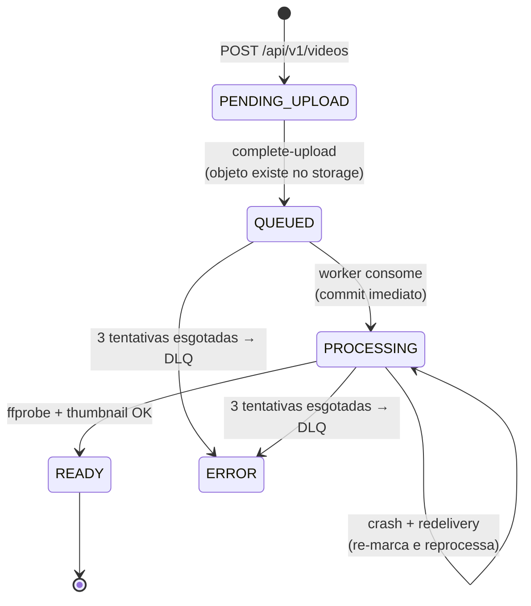

# Ciclo de vida do vídeo — máquina de estados

Transições do `VideoStatus`. Cada escrita de status no worker commita em transação própria e
curta (nenhuma conexão fica presa durante o FFmpeg), então `PROCESSING` é visível pela API
pública enquanto a análise roda.

| Status | Quem grava | Significado |
|---|---|---|
| `PENDING_UPLOAD` | API (`InitiateUploadUseCase`) | Rascunho criado; aguardando o PUT do cliente |
| `QUEUED` | API (`CompleteUploadUseCase`) | Objeto confirmado no storage; job publicado |
| `PROCESSING` | Worker (`ProcessVideoUseCase`) | FFprobe/FFmpeg em execução |
| `READY` | Worker | Duração, thumbnail e metadata gravados; stream liberado |
| `ERROR` | Worker (listener da DLQ) | Tentativas esgotadas; `error_message` preenchido |