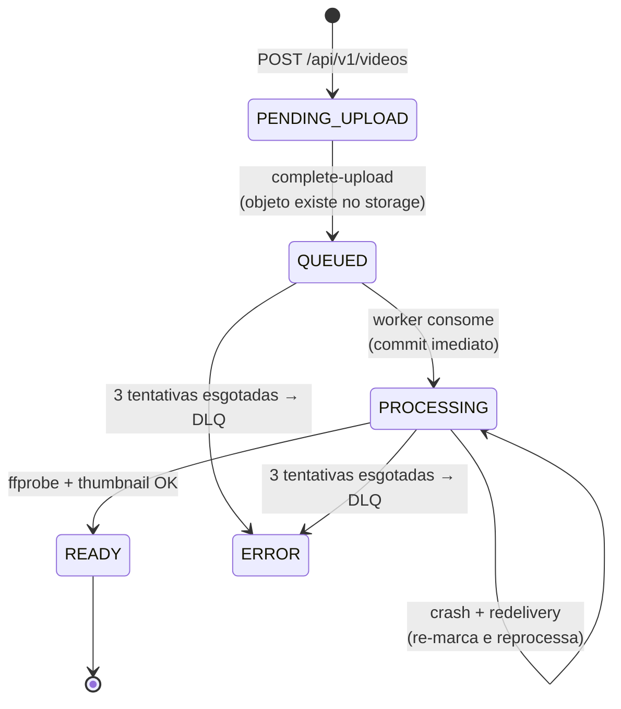

# Ciclo de vida do vídeo — máquina de estados

Transições do `VideoStatus`. Cada escrita de status no worker commita em transação própria e
curta (nenhuma conexão fica presa durante o FFmpeg), então `PROCESSING` é visível pela API
pública enquanto a análise roda.

| Status | Quem grava | Significado |
|---|---|---|
| `PENDING_UPLOAD` | API (`InitiateUploadUseCase`) | Rascunho criado; aguardando o PUT do cliente |
| `QUEUED` | API (`CompleteUploadUseCase`) | Objeto confirmado no storage; job publicado |
| `PROCESSING` | Worker (`ProcessVideoUseCase`) | FFprobe/FFmpeg em execução |
| `READY` | Worker | Duração, thumbnail e metadata gravados; stream liberado |
| `ERROR` | Worker (listener da DLQ) | Tentativas esgotadas; `error_message` preenchido |

## Publicação (Fase 04) — eixo ortogonal ao processamento

O status acima é o **ciclo de processamento**. A **publicação** é um eixo separado:
`published_at = null` ⇔ rascunho (todas as leituras respondem 404 para quem não é o dono);
`POST /api/v1/videos/{id}/publish` exige `READY` e é idempotente. Depois de publicado,
`visibility` decide a exposição em listagens.

```mermaid
stateDiagram-v2
    [*] --> Rascunho: initiate (visibility=PUBLIC)
    Rascunho --> Publicado: publish<br/>(exige status READY; 422 antes)
    Publicado --> Publicado: republish é no-op
    state Publicado {
        PUBLIC --> UNLISTED: PATCH visibility
        UNLISTED --> PUBLIC: PATCH visibility
    }
```

| Estado | Acesso por slug (info/stream/download) | Listagens públicas do canal |
|---|---|---|
| Rascunho (qualquer status) | só o dono (404 para os demais) | não aparece (só no painel `/channels/me/videos`) |
| Publicado `PUBLIC` | qualquer um | aparece |
| Publicado `UNLISTED` | qualquer um com o link | não aparece |