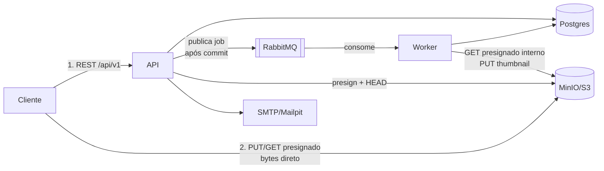
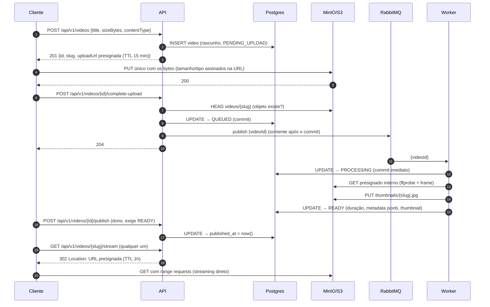
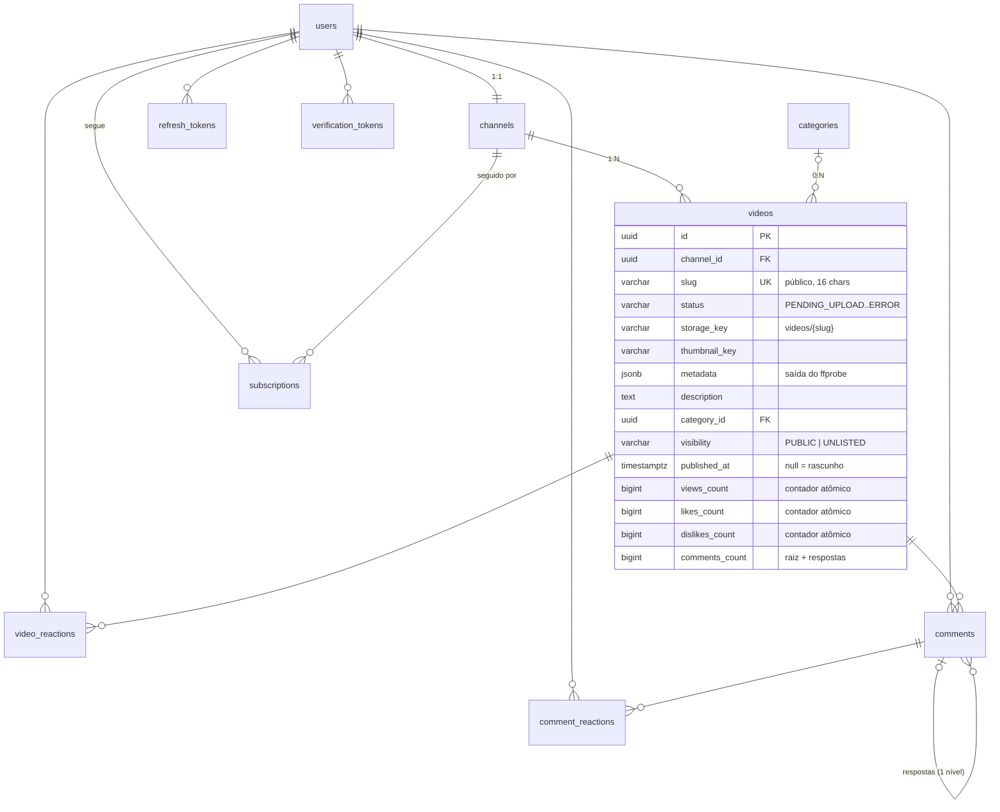

# StreamTube — System Design

Visão de sistema do backend: componentes, fluxo de upload ponta a ponta, decisões de projeto com
seus trade-offs e caminhos de evolução. Complementa os diagramas em [`docs/diagrams/`](diagrams/)
e o passo a passo de código em [`fluxo-upload-video.md`](fluxo-upload-video.md).

> **TL;DR do fluxo de upload:** a API devolve uma URL pré-assinada e o cliente faz **um único
> PUT** direto no MinIO/S3 (os bytes nunca passam pela API). O storage **não notifica ninguém**:
> é o **cliente** quem confirma chamando `complete-upload`; a API verifica o objeto (HEAD), marca
> `QUEUED` no Postgres e, **após o commit**, publica o job no RabbitMQ. O worker consome a fila,
> roda FFmpeg/ffprobe e atualiza o registro — que existe no Postgres **desde o início** (criado
> como rascunho no `initiate`), não só no final.

---

## 1. Componentes

| Componente | Tecnologia | Papel |
|---|---|---|
| **API** (`bootstrap-api`) | Spring Boot, stateless | Auth (JWT), orquestração de upload, gestão de vídeos/canais, leitura pública |
| **Worker** (`bootstrap-worker`) | Spring Boot + FFmpeg/ffprobe | Consome a fila e processa vídeos (duração, metadata, thumbnail) |
| **Postgres** | 17 | Fonte da verdade: users, channels, videos, categories, tokens (migrações Flyway, aplicadas só pela API) |
| **RabbitMQ** | exchange `video.exchange` → fila `video.processing` (+ DLX/DLQ) | Desacopla API e worker; retries e dead-letter |
| **MinIO / S3** | bucket `streamtube-videos` | Guarda vídeos (`videos/{slug}`) e thumbnails (`thumbnails/{slug}.jpg` / `-custom`); acesso só por URL pré-assinada |
| **Mailpit / SMTP** | dev: Mailpit | E-mails de confirmação e reset de senha |

A API e o worker compartilham o Postgres e o storage, mas **nunca se falam diretamente** — toda
comunicação entre eles passa pela fila (comando) ou pelo banco (estado).

---

## 2. Fluxo de upload ponta a ponta

Passo a passo com as regras de cada etapa:

1. **Initiate** — o cliente declara título, tamanho e content-type. A API valida
   (`video/*`, até `UPLOAD_MAX_SIZE_BYTES`, padrão 2 GiB), gera um slug único, **insere o vídeo
   no Postgres como rascunho** (`PENDING_UPLOAD`, `published_at = null`) e devolve uma URL de PUT
   pré-assinada. O tamanho e o tipo declarados fazem parte da assinatura SigV4: se o cliente
   enviar bytes diferentes do declarado, **o próprio storage rejeita** — a API não precisa
   conferir depois.
2. **Upload** — um **único PUT** direto no MinIO/S3. Os bytes nunca tocam a API (nem de ida nem
   de volta); a API só transporta JSON.
3. **Complete** — o storage não emite evento; **o cliente confirma**. A API então: valida o dono,
   faz um `HEAD` no objeto (upload realmente terminou?), transiciona para `QUEUED` e **publica o
   job na fila somente após o commit da transação** (via `AfterCommitExecutor`). Isso elimina a
   corrida em que o worker receberia o job antes do status estar visível no banco — ou pior,
   receberia um job de uma transação que sofreu rollback.
4. **Processamento** — o worker consome `video.processing`, marca `PROCESSING` em transação
   própria e curta (o status fica visível na API enquanto o FFmpeg roda; nenhuma conexão fica
   presa durante o processamento), baixa o vídeo por URL pré-assinada **interna** (host
   `minio:9000`, dentro da rede), extrai duração/metadata com ffprobe (gravada como `jsonb`) e um
   frame como thumbnail, e marca `READY`.
5. **Publicação** (Fase 04) — processado ≠ visível. O vídeo continua **rascunho** (404 para
   qualquer um que não seja o dono) até o dono chamar `publish`, que exige `READY` e é
   idempotente. `visibility` (`PUBLIC` | `UNLISTED`) decide exposição em listagens.
6. **Consumo** — `info`/`stream`/`download` devolvem 302 para URLs pré-assinadas de leitura
   (TTL 1h); o player faz streaming com range requests direto do storage. Cada `stream` de vídeo
   **publicado** soma 1 em `views_count` com um único `UPDATE ... + 1` atômico (Fase 05) — preview
   de rascunho pelo dono e downloads não contam, e não há dedup por sessão (reload conta de novo,
   trade-off aceito). A página de visualização ainda tem `GET /videos/{slug}/related`: sugestões
   da mesma categoria, publicadas + `PUBLIC`, mais recentes primeiro (fallback: últimos publicados
   da plataforma quando o vídeo não tem categoria).

---

## 3. Decisões de projeto e trade-offs

### 3.1 Bytes fora da API (URLs pré-assinadas)

A API nunca carrega bytes de vídeo. Upload e download acontecem direto no storage com URLs
assinadas de curta duração (PUT: 15 min; GET: 1h). Consequências:

- A API escala pelo custo de JSON + Postgres, não pelo throughput de vídeo.
- Sem risco de esgotar threads/memória do servlet container com arquivos de GB.
- O controle de acesso vira controle de **emissão de URL** (quem pode pedir a URL), não de fluxo
  de dados.

### 3.2 PUT único **e** multipart (Fase 08)

Para arquivos pequenos o upload continua **um PUT só**, com `Content-Length` e `Content-Type`
assinados na URL. Para arquivos grandes (ou redes instáveis) existe o segundo caminho, o **S3
Multipart Upload** — o cliente escolhe na iniciação. O racional da comparação continua valendo:

| | PUT único | Multipart |
|---|---|---|
| Complexidade | uma URL, um request | partes de 8 MiB, cada uma com sua URL |
| Falha no meio | recomeça do zero | reenvia só a parte perdida (**resume**) |
| Paralelismo | não | partes em paralelo (mais banda) |
| Quando usar | até poucas centenas de MB | arquivos grandes / conexão ruim (obrigatório > 5 GB, limite de PUT do S3) |

Fluxo multipart: `POST /videos/multipart` (cria o vídeo e a sessão; o servidor dita o tamanho da
parte) → `POST /videos/{id}/parts` devolve URLs **por parte, re-emissíveis** (TTL 1 h; expirou ou
falhou, pede de novo só aquela) → `GET /videos/{id}/parts` mostra o que já chegou (retomada após
queda/reboot) → `POST /videos/{id}/complete-multipart`. Duas decisões importantes: **o cliente
nunca vê ETags** — o servidor monta o objeto lendo as partes do próprio storage (`ListParts`), o
que é também o que torna o resume gratuito; e cada URL de parte assina o tamanho exato daquela
parte, com um HEAD final conferindo o total contra o declarado (divergiu: objeto descartado).
Depois do complete, o pipeline (QUEUED → worker → READY) nem sabe como os bytes chegaram.
Sessões abandonadas são varridas por regra de lifecycle do bucket (ver `deploy.md`).

### 3.3 Confirmação pelo cliente, não por evento do storage

Alternativa clássica: S3 Event Notification (ou MinIO bucket notification) → fila → worker, sem
participação do cliente. Optou-se pela confirmação explícita (`complete-upload`) porque:

- **Portabilidade** — funciona idêntico em MinIO, S3, ou qualquer S3-compatível, sem configurar
  notificação de bucket por ambiente.
- **Validação no caminho** — a confirmação passa pela API, que valida dono e status e faz o HEAD;
  um evento do storage chegaria "cru", sem contexto de autorização.
- **Transação como fonte de verdade** — o job só entra na fila depois do `QUEUED` commitado; com
  eventos do storage seria preciso reconciliar evento × estado do banco.

Custo: se o cliente morrer entre o PUT e o `complete-upload`, o vídeo fica `PENDING_UPLOAD` com o
objeto órfão no storage (inofensivo; um job de limpeza por idade resolveria — não implementado).

### 3.4 Fila com retry, DLQ e idempotência

- Listener com retry: **3 tentativas** (intervalo inicial 5s, multiplicador 2.0), depois a
  mensagem vai para a DLQ (`video.processing.dlq` via DLX `video.dlx`), onde um segundo listener
  marca o vídeo como `ERROR` com `error_message`.
- **Idempotência**: redelivery é esperado. Vídeo já `READY` é ignorado; vídeo preso em
  `PROCESSING` (crash no meio) é re-marcado e reprocessado do zero — as escritas do worker são
  "última vence", então reprocessar é seguro.
- A DLQ não tem dead-letter próprio: falha ao marcar `ERROR` é logada alto (sinal de
  reconciliação manual) em vez de derrubar a mensagem.

### 3.5 O registro nasce no initiate

O vídeo existe no Postgres desde o primeiro passo, como rascunho. Isso dá:

- slug/id estáveis para o cliente acompanhar o status (`QUEUED → PROCESSING → READY`) por polling;
- trilha de todo upload iniciado (inclusive abandonados);
- chave natural de idempotência para o pipeline inteiro.

### 3.6 Publicação ortogonal ao processamento (Fase 04)

Dois eixos independentes: `status` (ciclo técnico, quem grava é o pipeline) e
`published_at`/`visibility` (decisão do dono). `publish()` exige `READY` — é impossível, por
construção, publicar algo que ainda pode falhar no processamento. Rascunhos respondem **404**
(não 403) para não-donos, para não vazar a existência do vídeo. `UNLISTED` é acessível pelo slug,
mas nunca aparece em listagem.

### 3.7 Clean Architecture

`domain` (regras puras, zero framework) ← `application` (use cases, orquestração) ←
`infrastructure` (adapters: JPA, MinIO, Rabbit, SMTP, JWT) ← `bootstrap-api`/`bootstrap-worker`
(composição). Direção de dependência garantida por teste ArchUnit. O worker monta um contexto
Spring **mínimo** (só storage/messaging/persistence — nada de auth/mail/web), e as entidades JPA
usam colunas UUID simples em vez de associações para manter essa unidade de persistência enxuta.

---

## 4. Modelo de dados (essência)

Índices de listagem: `(channel_id, created_at DESC)` para o painel do dono e índices **parciais**
sobre `WHERE visibility='PUBLIC' AND published_at IS NOT NULL` para as queries públicas —
`(channel_id, published_at DESC)` (página do canal), `(category_id, published_at DESC)`
(sugestões) e `(published_at DESC)` (grid da home). A busca (`ILIKE '%q%'` em título/nome do
canal) usa índices GIN trigram (`pg_trgm`) em `videos.title` e `channels.name`, porque o wildcard
à esquerda inutiliza btree.

**Contadores desnormalizados (Fases 05–06):** as tabelas normalizadas (`video_reactions`,
`comment_reactions`, `comments`, `subscriptions`) são a fonte da verdade — PK composta
`(user_id, alvo)` torna duplo-like/dupla-inscrição impossível. Os contadores (`views_count`,
`likes_count`, `dislikes_count`, `comments_count`, `subscribers_count`) movem-se **somente** por
`UPDATE ... ± 1` atômico, na mesma transação da mudança da linha-fonte e condicionado ao
row-count do statement que mudou a linha (um `ON CONFLICT DO NOTHING` que não inseriu não
incrementa). Nas entities JPA os contadores são `updatable = false`: um `save()` comum nunca
reescreve o valor com um snapshot velho. A camada social é **exclusiva da API** — o worker não
mapeia essas tabelas.

---

## 5. Segurança (resumo)

- **JWT stateless** (access curto + refresh com rotação e detecção de reuso por família).
- Allowlist explícita: tudo exige auth por padrão; leituras públicas liberadas uma a uma
  (`GET /videos/**`, `GET /categories`, `GET /comments/**`, `GET /search`,
  `GET /channels/**` — com `/channels/me/**` autenticado **antes** na cadeia). Escritas sociais
  (reações, comentários, inscrições) caem no default autenticado.
- **Rate limiting** por IP (token bucket, 10 req/min) nos endpoints de auth.
- Autorização de escrita sempre no use case (dono do recurso), com corridas de unicidade
  (email, nickname) resolvidas por constraint do banco traduzida para 409.
- URLs pré-assinadas de curta duração; upload restrito por tamanho/tipo assinados.

---

## 6. Escalabilidade e evolução

**Hoje:** API stateless (escala horizontal atrás de load balancer), workers concorrentes
(a fila distribui; idempotência torna redelivery seguro), bytes 100% no storage.

**Já entregues como melhorias pós-1.0:**

1. ~~**Multipart upload**~~ — **Fase 08** (§3.2): partes re-emissíveis + resume.
2. ~~**Transcodificação multi-bitrate (HLS)**~~ — **Fase 09**: o worker gera a escada
   (720p/480p/360p limitada pela altura do fonte, H.264+AAC, TS de 6s) no PROCESSING; as
   **playlists** passam pela API (`/videos/{slug}/hls/...` — matriz de visibilidade + view na
   master) e os **segmentos** vão direto do storage com URLs presignadas de TTL longo (6h).
   Catálogo antigo (`hls_master_key` null) toca pelo `/stream` progressivo.

3. ~~**CDN** na frente do storage~~ — **Fase 10**: perfil opt-in (`CDN_ENABLED`) em que as URLs
   públicas de leitura (stream, download, thumbnails, segmentos HLS) apontam para um edge com
   token `secure_link` (o esquema das CDNs comerciais) e cache de resposta; uploads e leituras
   internas do worker continuam presignados direto no storage. A integração é um decorator sobre
   o `StoragePort` — zero mudança nos use cases. A autorização segue na emissão de URL pela API.

**Caminhos naturais restantes, sem mudar a arquitetura:**

4. **Notificação de bucket** substituindo o `complete-upload` se o requisito de portabilidade
   mudar (§3.3).
5. **Limpeza de órfãos** — job periódico para `PENDING_UPLOAD` antigos e objetos sem registro
   (sessões multipart abandonadas já são varridas por lifecycle do bucket, ver `deploy.md`).

## Referências

- [`diagrams/01-arquitetura-camadas.md`](diagrams/01-arquitetura-camadas.md) — camadas e dependências
- [`diagrams/02-sequencia-upload-completo.md`](diagrams/02-sequencia-upload-completo.md) — sequência completa
- [`diagrams/04-topologia-rabbitmq.md`](diagrams/04-topologia-rabbitmq.md) — exchange/fila/DLQ
- [`diagrams/05-ciclo-de-vida-video.md`](diagrams/05-ciclo-de-vida-video.md) — máquinas de estado (processamento e publicação)
- [`fluxo-upload-video.md`](fluxo-upload-video.md) — o mesmo fluxo com trechos de código, camada por camada
